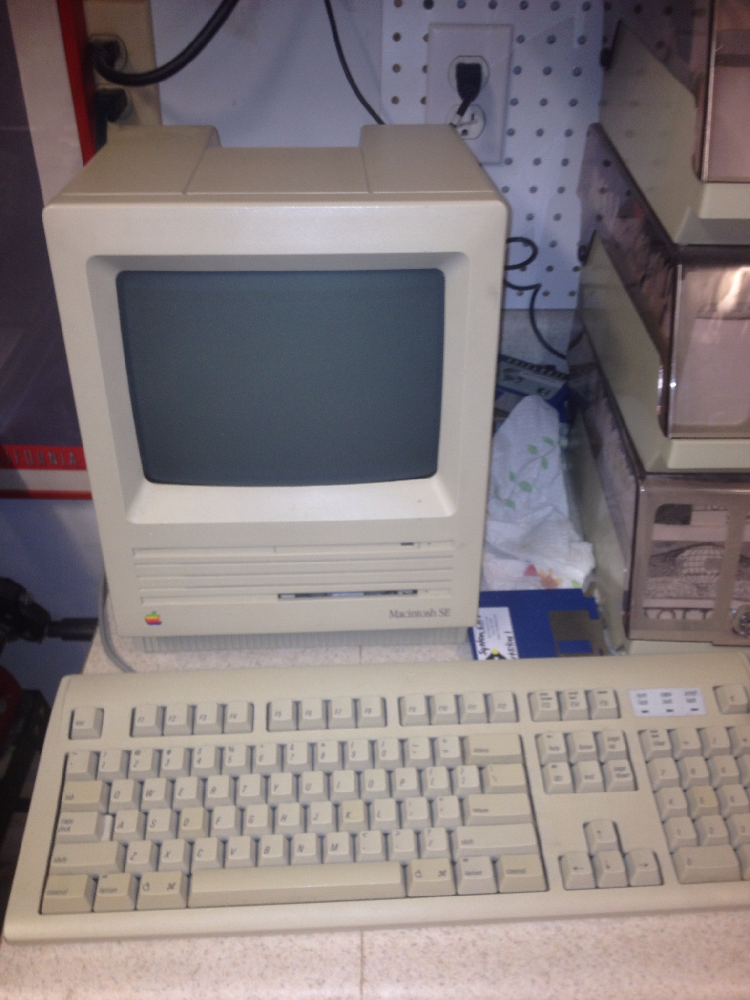
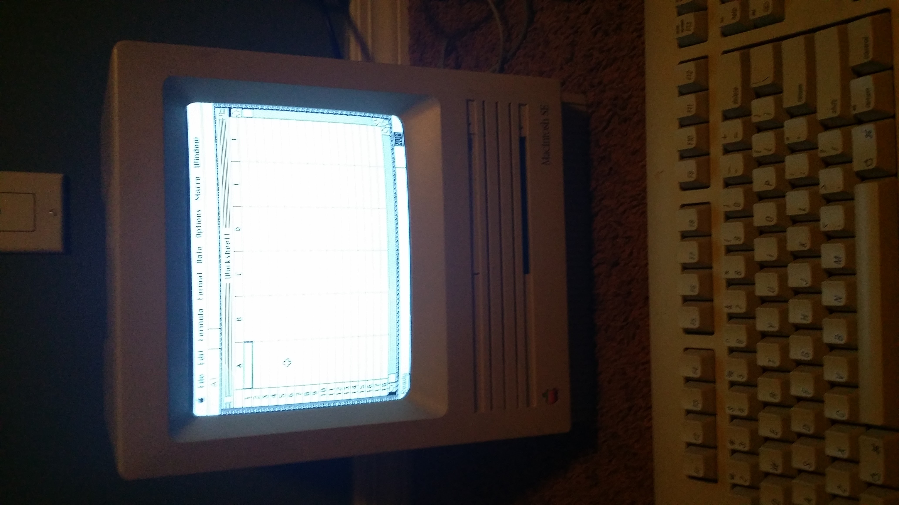
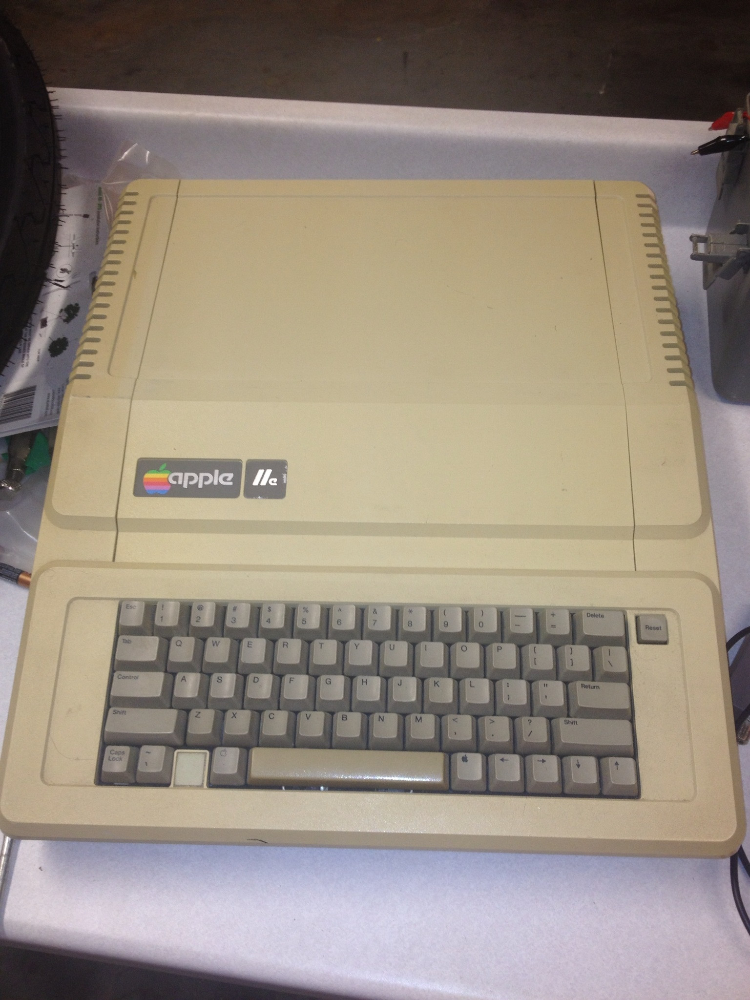
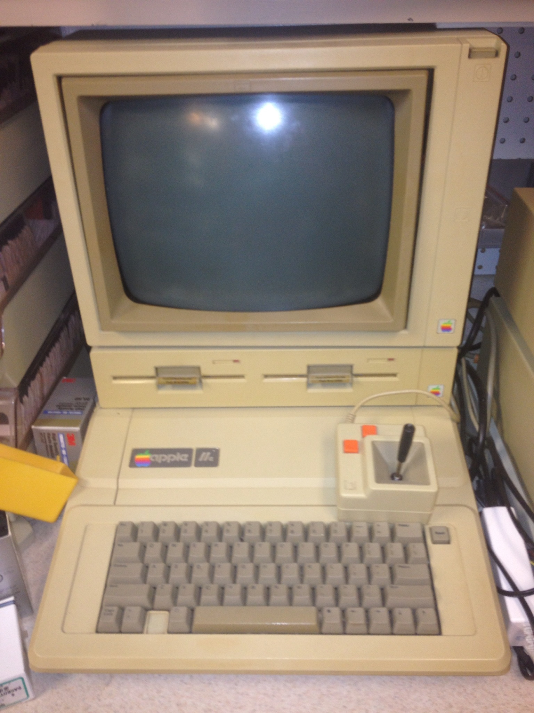
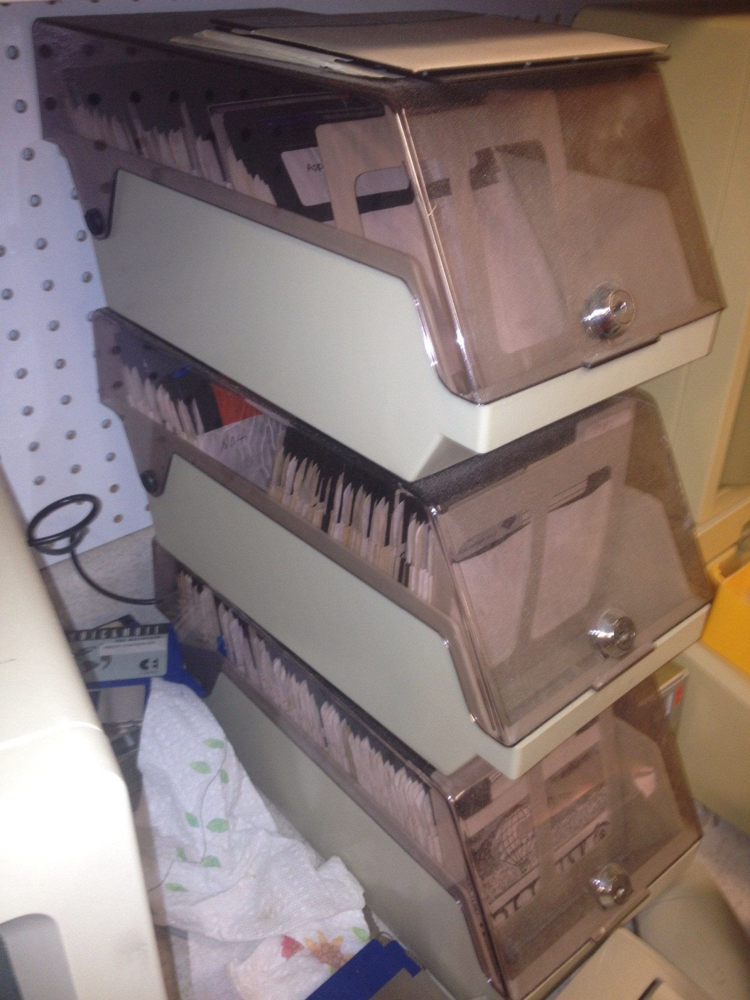
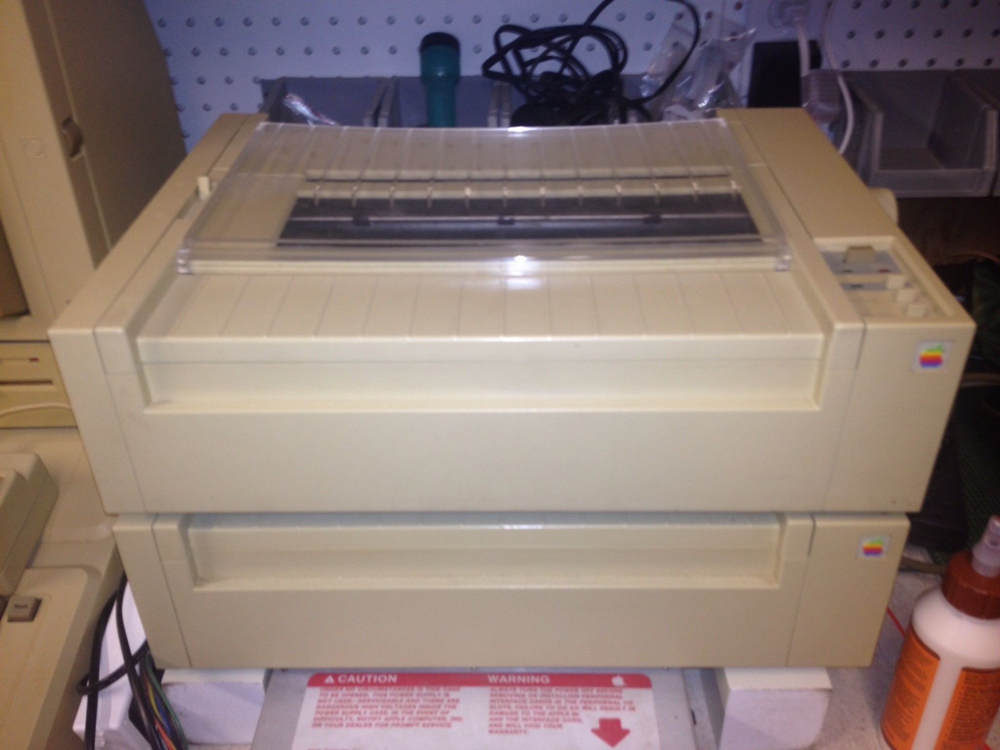
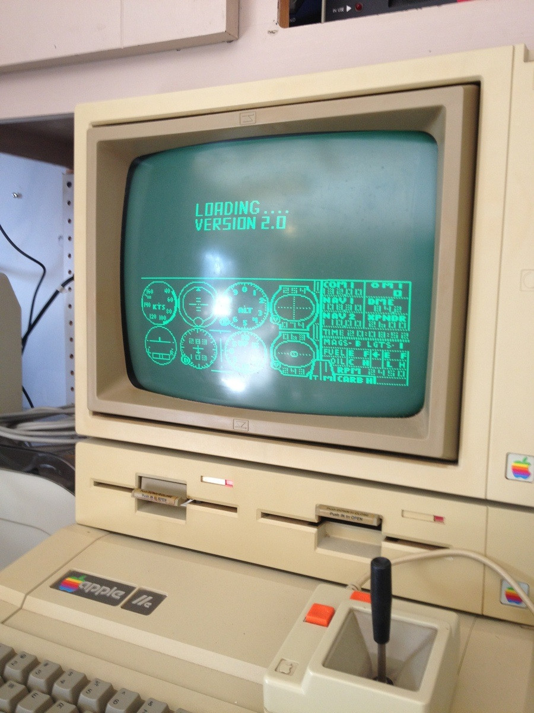

In sixth grade I did a school project on Steve Wozniak. The more I learned, the more I became interested in the history of Woz, Apple, and the personal computer revolution.

Naturally, I had to get my hands on one of these Apple computers from the 70's and 80's. My first was a Macintosh SE, and from there an addiction was born...

## The Macintosh SE

I got this one while I was actually still working on that Woz project, and prominently displayed it during my presentation. I got the SE for $5 from a local electronics recycling plant, and I like to think that I "saved it from the dumpster". It still works!

Here's a rather poor quality photo of it running Excel:

## The First Apple IIe

The 9 inch Macs are super cool. It was the first Apple Computer I ever owned, but an Apple II was always the dream. I got this IIe from a surplus electronics store shortly for $20 after the Woz project was over. It's all there, powers on, and even outputs video to a monitor - but I could never get it to fully work. Keyboard inputs always led to jumbled characters on the display and I wasn't skilled or experienced enough to troubleshoot it. Maybe one day I'll take another look and try to get her running.

## Grandpa's IIe

At this point my interest was widely apparent, and my unbeknownst to me, my grandpa still had his Apple IIe that he purchased new when it came out, years before I was even born. My mom talked to her dad and arranged to have him send it to me as a surprise, and I was thrilled! With the IIe came a stack of boxes taller than I was - filled with expansion cards, software, manuals, accessories, and more.

I always wanted an Apple II of some kind, and this was more than I could ever ask for. I wrote my first program on this very computer in Applesoft BASIC. All it did was output numbers ascending from 1 upward, but I still remember it.

FS 2.0 - As real as it gets!

## More

After the IIe, things progressed.

Eventually I'll post more of the collection. By now I have 2 more 9 inch Macs, extra disk drives, a few "newer" Macs, a couple more Monitor IIs, a couple of Monitor IIIs, the list goes on...
