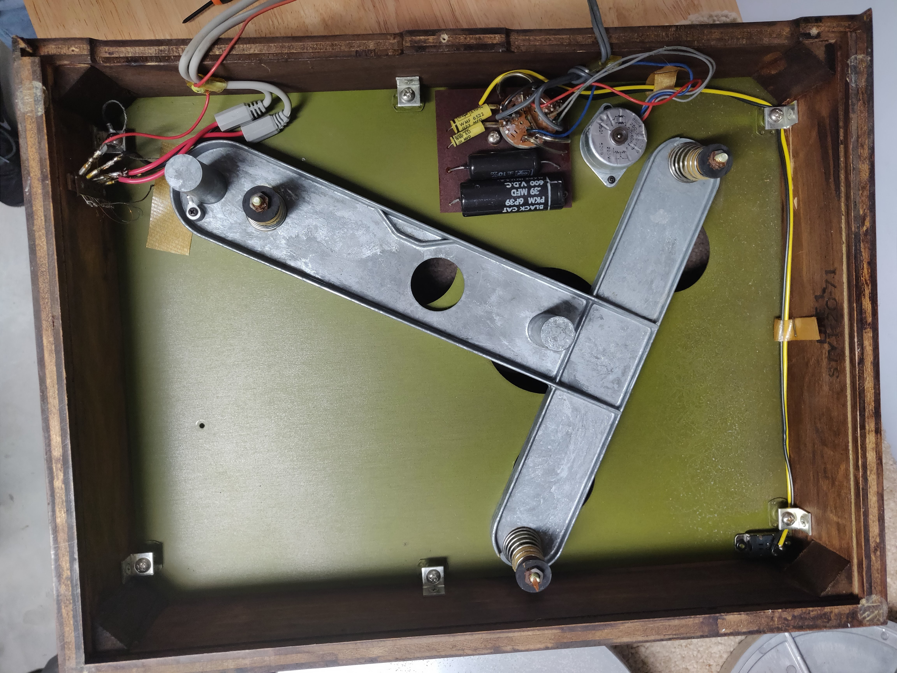

Here I'll be documenting my ongoing project to restore my AR model XA turntable, presented in "Oiled Walnut" finish.

The one I'm working had been sitting for at least a couple of years and deserved to get rebuilt - with a few upgrades.

### Before

Pretty awful condition.

Main concerns:
* Heavy degradation of the paint on the metal base of the plinth
* Condition of the foam platter mat
* Replacing the phono cartridge

Before I started, I researched other XA rebuild projects. [I was inspired and heavily assisted by this page](http://johnsweather.com/Turntable.html), which contains detailed photos and descriptions for every step in the process of restoring one of these turntables.

With a better understanding of both how this turntable works and what exactly I was getting myself into, I made a plan and set out with the following goals:

  1. Repaint the metal base of the plinth. This was likely going to be one of the more intense aspects of the project.
  2. Replace the deteriorated power and audio cables with respective jacks mounted on the back of the turntable.
  3. Rewire the tonearm internally, fix the tonearm stand which had previously snapped off and been taped to a metal rod to hold it upright.
  4. Exchange the well worn cartridge that was previously installed with a cleaner and more high quality replacement. Then recalibrate the tonearm and tracking force.
  5. Replace the previous platter foam with a new higher quality mat.

### Step 1: Disassembly

Step one was to take the whole thing apart. It's unsurprisingly not too complicated inside.

Despite the overall condition being significantly poor, the turntable did indeed operate prior to any work I did on it. Regardless, in the shape it was in, had I tried to play anything it would probably eat my record pretty quickly.

### Repainting the Metal Base of the Plinth

Here it is by itself after removing all of the major components and hardware. You can really see how poor the condition of the paint became, and it was definitely the worst aspect of the table appearance wise.

As I expected, stripping all this nasty paint off of the plinth turned out to be pretty difficult. I used a can of "Goof Off" spray on paint stripper to start the process and get the thicker areas of paint mostly gone before I started to sand it down.

This paint stripper is nasty stuff, don't get it on your hands.

I followed the directions on the bottle, spraying a layer of the stripper onto the top of the plinth, waiting a bit, and then using a scraper to slowly push the old paint off of the metal. This was a very messy, gross, and probably pretty unhealthy process. But after about two or three iterations of Goof Off coats, I was able to remove most of the old paint.

One coat started to make some progress, you can see here in the bottom left corner some metal is starting to show. But there's still a ton of paint caked on, and it's definitely gonna take a few more repetitions to get ready to sand.

Getting better...

This wasn't my ideal point to start sanding, but considering how strong the chemicals in that Goof Off were, I decided to move on a bit earlier than I originally planned. Even so, much of the paint was removed at this point and overall I was happy with how much I was able to take off.

Sanded the plinth down to bare metal to prep it for a fresh coat of new paint. I decided to go with glossy black.

Other projects seemed to simply use Rust-Oleum spray paint, so I followed along.

The paint is still wet in this photo, but I'll be repainting it anyway for reasons explained below.

Unfortunately, the sanding job was less than perfect, and the paint didn't take very well at first. In my first attempt, there was a lot of bubbling which you can see in the photos above. I'm going to need to re-sand the plinth and possibly determine a better technique to paint it.

### Replacing Old Wiring with Jacks
